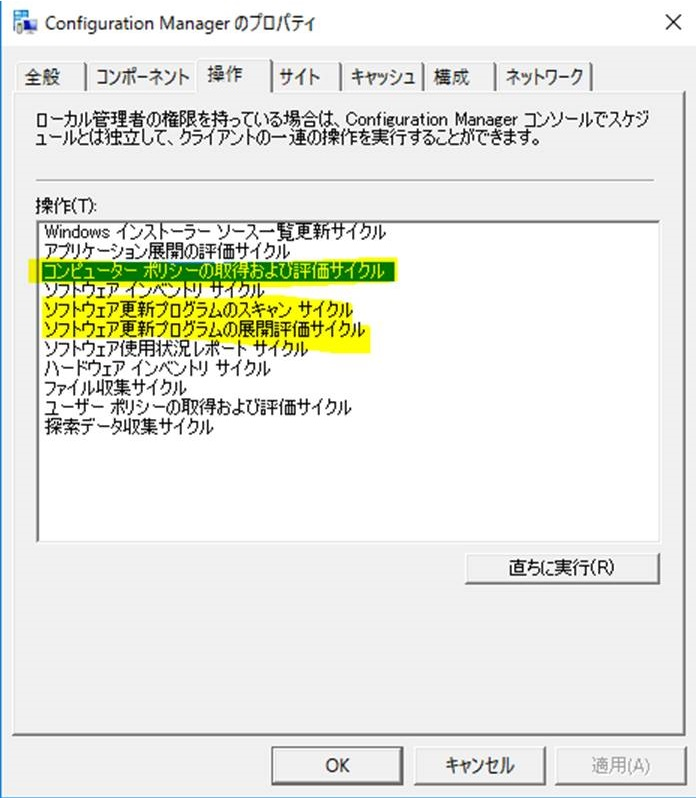

# System Center Configuration Manager で、できる限り早く更新プログラムを適用する方法について

みなさま、こんにちは。

日本マイクロソフト System Center Configuration Manager サポート チームの金です。

本ポストでは、System Center Configuration Manager (以下、Configuration Manager) で更新プログラムを配信する運用をしている中で、可能な限り早く更新プログラムを適用させる方法をご紹介いたします。

OS やアプリケーションにおいては、深刻な脆弱性等が発覚した際に、脆弱性による被害を防ぐために、至急セキュリティ更新プログラムの適用が必要になる場合がございます。

そのとき、Configuration Manager コンソールから、更新プログラムを配信する際に、展開方法を “必須” としても、クライアントが更新プログラムの展開を検知し、ダウンロードおよびインストールするまではある程度時間がかかります。

それは、Configuration Manager クライアントは、基本的に Configuration Manager コンソールにて設定したスケジュールのとおり動作しているためです。

Configuration Manager クライアントが更新プログラムを適用するには、以下の順のとおり、3 つのサイクルの実行が必要となります。

1. ソフトウェア更新プログラムのスキャン サイクル:  
  ソフトウェアの更新ポイント (WSUS) サーバーに対してスキャンを行い、更新プログラムの必要有無を判断します。  
  このサイクルは、既定で 7 日間隔で実行されます。
1. コンピューター ポリシーの取得および評価サイクル:  
  SCCM サーバーで設定された更新プログラムの展開を受信します。  
  このサイクルは、既定で 1 時間間隔で実行されます。
1. ソフトウェア更新プログラムの展開評価サイクル:  
 過去に受信した展開でインストールに失敗した更新プログラムがあれば再評価し、インストールを再試行します。  
 このサイクルは、既定で 7 日間隔で実行されます。


上記サイクルは、コントロール パネルを開き、[システムとセキュリティ] にある [Configuration Manager] をダブルクリックし、[操作] タブより、直ちに開始することができます。



これらのサイクルを手動で開始する場合は、(1) (2) (3) と順番に数分おきに実施いただくと、更新プログラムのダウンロードが始まります。更新プログラムのダウンロード完了したかどうかについては、SCCM のキャッシュ フォルダー (既定で %windir%\ccmcache) に実行した時刻のフォルダーとファイルが存在するかで確認できます。

なお、通常の運用では、クライアントがネットワークに接続し、Configuraition Manager のサーバー (管理ポイント、配布ポイント、ソフトウェアの更新ポイント) と問題なく通信できていれば、時間の経過とともに更新プログラムが適用可能となりますが、お急ぎで更新プログラムを適用させたい場合や長期間オフライン状態であった端末においては、スクリプト等で、サイクルを直ちに実行することも可能です。

これからご案内するスクリプトは、以下の動作を実現しております。

1. [ソフトウェアの更新のスキャン サイクル] を開始する。
2. 5 分待機
3. [コンピューター ポリシーの取得および評価サイクル] を開始する。
4. 5 分待機
5. [ソフトウェアの更新の展開評価サイクル] を開始する。

以下は、スクリプトのサンプルとなります。

スクリプト サンプルをご利用の際は、お客様環境で、事前に動作確認を行っていただきますようお願いいたします。

ファイルの拡張子を .vbs としていただき、以下のようなコマンドをご実行ください。

`cscript /nologo KickoffClientAction.vbs`

```vbs

Call Main

Sub Main()

  KickoffClientAction "Updates Source Scan Cycle"

  WScript.sleep 300000

  KickoffClientAction "Request & Evaluate Machine Policy"

  WScript.sleep 300000

  KickoffClientAction "Software Updates Assignments Evaluation Cycle"

End Sub

' *******************************************************************

' KickoffClientAction() - This sub will kickoff the specified client action

' *******************************************************************

Sub KickoffClientAction(sActionName)

  ' Create a CPAppletMgr instance

  Dim oCPAppletMgr

  Set oCPAppletMgr = CreateObject("CPApplet.CPAppletMgr")

  ' Get the available ClientActions

  Dim oClientActions

  set oClientActions = oCPAppletMgr.GetClientActions()

  ' Loop through the available client actions

  Dim oClientAction

  For Each oClientAction In oClientActions

    ' Is this the action we want to kickoff?

    If oClientAction.Name = sActionName Then

      ' Kickoff the action

      oClientAction.PerformAction

    End If

  Next

End Sub
```

(補足情報)

スクリプトの本文を繰り返して、複数回実行するように追記していただくことも可能です。

なお、待機時間につきましても、お客様のご要望に応じて、短く変更していただくことも可能でございます。

>※ Wscript.sleep の単位は、ミリ秒となります。(1秒 = 1000ミリ秒)

また、```KickoffClientAction ""``` で囲まれた部分を以下に変更することで、他のサイクルの実行をすることも可能です。

今後の運用にお役立ていただけますと幸いでございます。

- Software Metering Usage Report Cycle ：  
 「ソフトウェア使用状況レポート サイクル」の実行
- Request & Evaluate Machine Policy ：  
「コンピューター ポリシーの取得および評価サイクル」の実行
- Updates Source Scan Cycle ：  
「ソフトウェア更新プログラムのスキャン サイクル」の実行
- Request & Evaluate User Policy ：  
  「ユーザー ポリシーの取得および評価サイクル」の実行
- Hardware Inventory Collection Cycle ：  
「ハードウェア インベントリ サイクル」の実行
- Software Inventory Collection Cycle ：  
「ソフトウェア インベントリ サイクル」の実行
- Software Updates Assignments Evaluation Cycle ：  
「ソフトウェア更新プログラムの展開評価サイクル」の実行
- Discovery Data Collection Cycle ：  
「探索データ収集サイクル」の実行
- MSI Product Source Update Cycle ：  
「Windows インストーラー ソース一覧更新サイクル」の実行
- Standard File Collection Cycle ：  
「ファイル収集サイクル」の実行