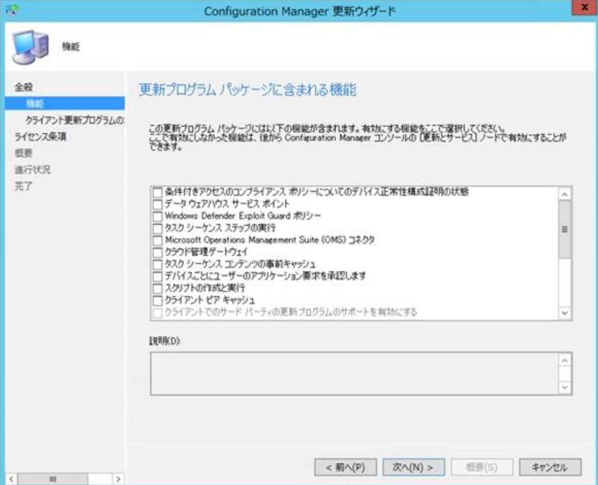
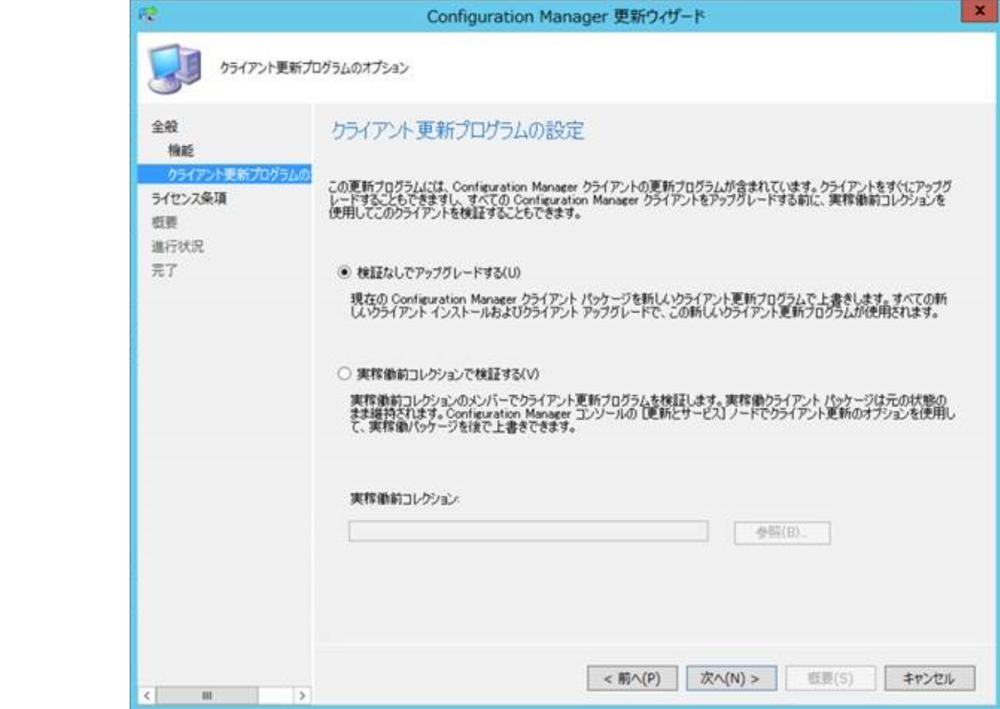
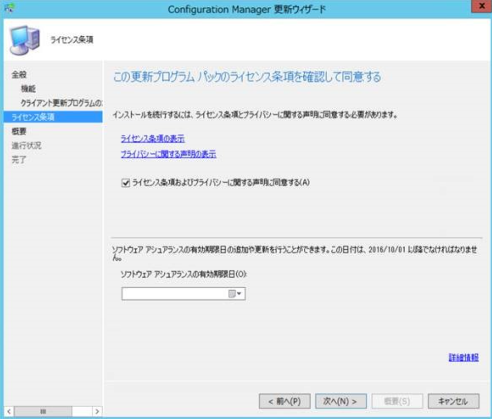
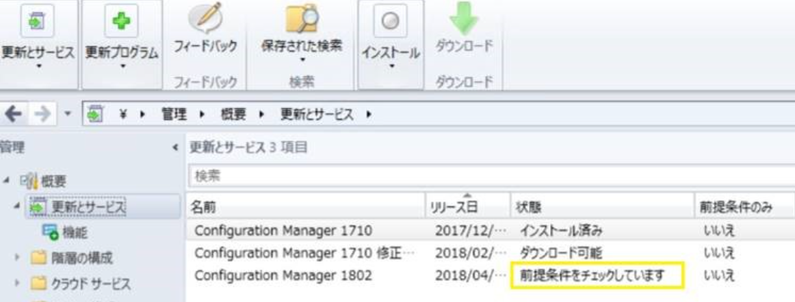
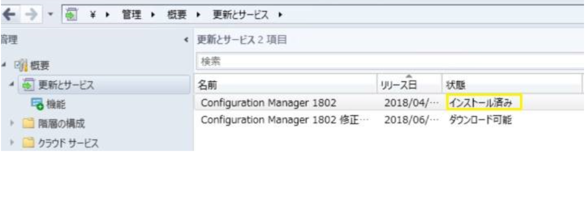
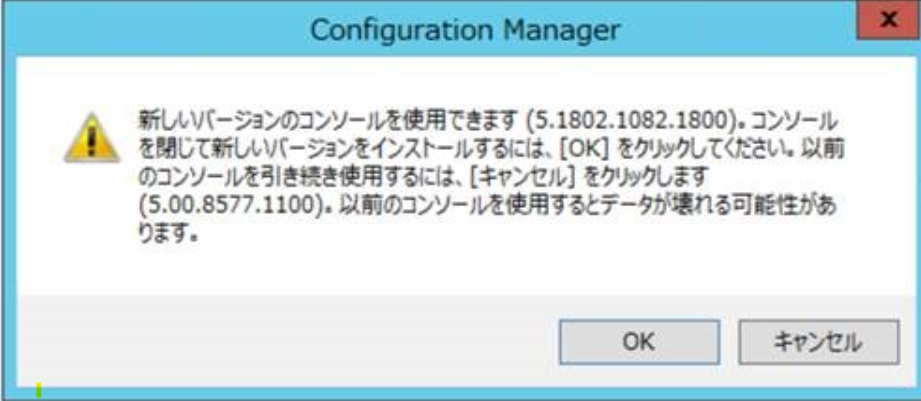
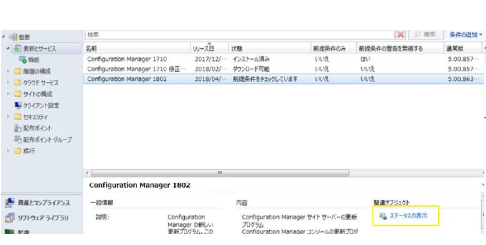
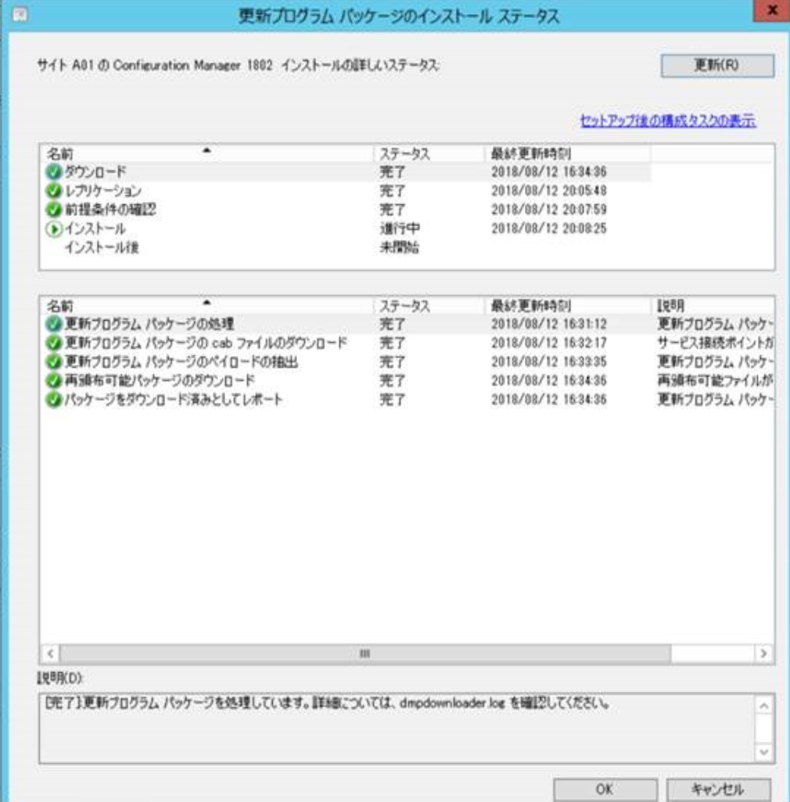
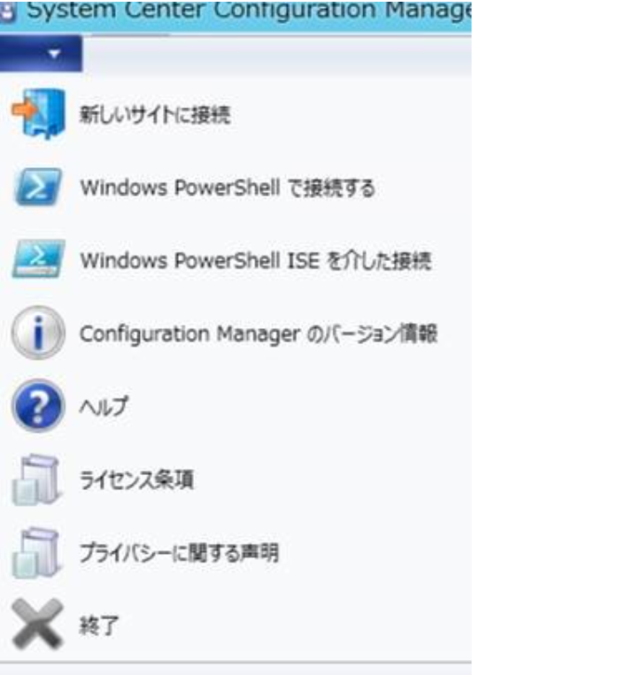
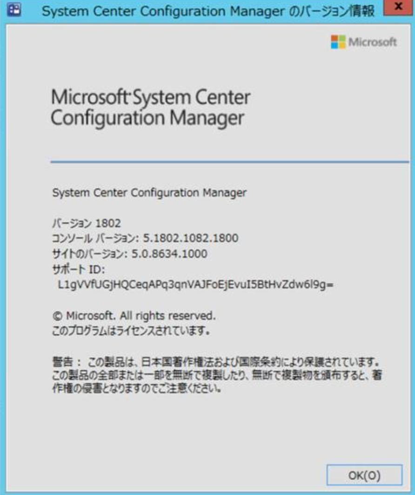

# System Center Configuration Manager サイトのアップグレード手順

みなさま、こんにちは。

日本マイクロソフト System Center Configuration Manager サポートチームです。

本日は、System Center Configuration Manager Current Branch (以下、SCCM CB) をアップグレードする手順をご案内させていただきます。
SCCM CB のバージョンアップは、最上位のサイト サーバーで実施します。
中央管理サイト サーバーがある階層型の環境の場合、中央管理サイト サーバーで、プライマリ サイト サーバーの環境の場合は、プライマリ サイト サーバーで実施してください。
最上位のサイト サーバーがアップグレードされる過程で、その配下のサイト サーバーや、管理ポイント、配布ポイント等のサイトシステムは、自動的に更新されます。

これから、SCCM CB 1710 から、最新バージョンの SCCM CB 1802 へのアップグレード手順をご案内いたします。
また、SCCM CB でのアップグレードは累積となり、新しいバージョンが古いバージョンの内容を含んでおりますため、中間バージョンを踏まずに、最新バージョンにアップグレードすることができます。
なお、SCCM CB の場合、他のバージョンからでも、本手順と同様な手順でアップグレードすることができます。

### 本手順は、以下の流れとなっております。

--------------
A. SCCM CB バージョンアップの手順
B. アップグレードの状況を確認する手順
C. SCCM CB バージョンを確認する手順
D. サイト システムのアップグレード完了を確認する手順
--------------

## A. SCCM CB バージョンアップの手順

1. [Configuration Manager コンソール] から、以下の画面に移動します。
-[管理] - [概要] - [更新とサービス]

2. [更新とサービス] の一覧から、"Configuration Manager 1802" の [状態] を確認します。

3. [状態] が、"ダウンロード可能" の場合は、"Configuration Manager 1802" と右クリックし、[ダウンロード] をクリックします。
[状態] が、"インストール" の場合は、"インストールの準備完了" の場合は、既にダウンロード済みとなりますので、手順 7 からご実施ください。

4. "更新プログラムを確認しています。…" とのメッセージが表示されますので、[OK] をクリックします。

5. ダウンロードが開始されますので、ダウンロードが完了するまで、しばらく待機します。

6. ダウンロードが完了し、上記の手順 2 の 画面の [更新とサービス] の一覧から、"Configuration Manager 1802" の [状態] が "インストールの準備完了" となっていることを確認します。

7. "Configuration Manager 1802" を右クリックし、[更新プログラム パックのインストール] をクリックします。

8. [Configuration Manager 更新ウィザード] が表示されますので、[全般] の画面で、[次へ] をクリックします。

9. [機能] の画面で、追加したい機能がございましたら、チェックを入れ、[次へ] をクリックします。
機能は、必要になった場合、後から追加することもできます。
本手順では、既定のとおり、そのまま [次へ] とさせていただきます。

10. [クライアント更新プログラムのオプション] の画面で、サイトとともに、そのままクライアントをアップグレードする場合は、"検証なしでアップグレードする" を選択し、[次へ] をクリックします。
クライアント アップグレードの検証をする場合は、"実稼働前コレクションで検証する" を選択し、検証用コレクションを指定後、[次へ] をクリックします。
本手順では、既定のとおり、"検証なしでアップグレードする" を選択させていただきます。

11. [ライセンス条項] の画面で、"ライセンス条項およびプライバシーに関する声明に同意する" にチェックを入れ、[次へ] をクリックします。

12. [概要] の画面で、[次へ] をクリックします。

13. 更新ウィザードが正常に完了したことを確認し、[閉じる] をクリックします。

14. "Configuration Manager 1802" の [状態] が、"前提条件をチェックしています" と更新され、前提条件のチェック処理が開始されます。

前提条件で問題なく合格した場合、そのままインストールに進みますので、しばらく待機します。
インストールの状況を確認する手順につきましては、本文の最後に補足として記載させていただきます。

15. インストールが完了しますと、 "Configuration Manager 1802" の [状態] が、"インストール済み" と更新されます。

16. [Configuration Manager 1802 修正プログラム" をインストールする場合は、上記のインストール手順と同様に、対象更新プログラムをダウンロード後、インストールをご実施いただくことで、適用可能です。
上記で、SCCM CB のバージョンアップ後、コンソールの操作を行う際に、"新しいバージョンのコンソールを使用できます" のメッセージが表示される場合、[OK] をクリックします。

コンソールが閉じられ、コンソールのバージョンアップが開始されますので、しばらく待機した後に、コンソールを開いてくださいますようお願いいたします。

## B. アップグレードの状況を確認する手順

1. [Configuration Manager コンソール] から、以下の画面に移動します。
[管理] - [概要] - [更新とサービス]

2. [更新とサービス] の一覧から、"Configuration Manager 1802" を選択し、画面の下段にある "ステータスの表示" をクリックします。

3. 続きます画面で、リボンメニューから、"ステータスの表示" のボタンをクリックします。

4. [更新プログラム パッケージのインストール ステータス] の画面にて、インストール状況がご確認いただけます。

## C. SCCM CB バージョンを確認する手順

1. [Configuration Manager コンソール] の左上にある逆三角形のボタンをクリックし、[Configuration Manager のバージョン情報] をクリックします。

2. [System Center Configuration Manager のバージョン情報] の画面の"バージョン" にて、サイトのバージョンをご確認いただけます。

## D. サイト システムのアップグレード完了を確認する手順
上述の通り、サイトのアップグレードが完了すると、管理ポイントや配布ポイントなどのサイト システムは自動的にアップグレードが行われます。

以下の手順で、サイトのアップグレード後にサイト システムのアップグレードが成功していることをご確認頂けます。

## 手順
1. Configuration Manager コンソールを開き、以下の順に展開します。
[監視] - [概要] - [システムのステータス] - [コンポーネントのステータス]

2. 右ペインに表示された一覧から、以下のコンポーネントを右クリックし、 [メッセージ表示] - [すべて] をクリックします。

管理ポイントの場合 : SMS_MP_CONTROL_MANAGER
配布ポイントの場合 : SMS_DISTRIBUTION_MANAGER
ソフトウェアの更新ポイントの場合 : SMS_WSUS_CONFIGURATION_MANAGER

3. 表示期間を設定するダイアログ ボックスが開きますので、"1 ヵ月前" などアップグレード完了日時を含む期間を選択し、[OK] をクリックします。

4. アップグレードされた付近の日時にて、以下のようにメッセージ ID 1017, 1018, 1019 のログが記録されていることを確認します。

記録されていれば、コンポーネントが正常にアップグレードされたと判断頂けます。

・管理ポイント (SMS_MP_CONTROL_MANAGER)
重要度 種類 サイト コード 日付/時刻 システム コンポーネント メッセージ ID 説明
情報 マイルストーン T01 2018/03/26 23:13:09 MP01.MS.LOCAL SMS_MP_CONTROL_MANAGER 500 このコンポーネントが開始しました。
情報 マイルストーン T01 2018/03/26 23:13:07 MP01.MS.LOCAL SMS_MP_CONTROL_MANAGER __1019__ __サイト__ __コンポーネント__ __マネージャーは、このサイト__ __システムにこのコンポーネントを正常に再インストールしました。__
情報 マイルストーン T01 2018/03/26 23:11:12 MP01.MS.LOCAL SMS_MP_CONTROL_MANAGER 1018 サイト コンポーネント マネージャーは、このサイト システムにこのコンポーネントを再インストールしています。
情報 マイルストーン T01 2018/03/26 23:08:02 MP01.MS.LOCAL SMS_MP_CONTROL_MANAGER 1017 サイト コンポーネント マネージャーは、このサイト システムにこのコンポーネントを再インストールする必要があることを検出しました。サイト コンポーネント マネージャーは、コンポーネントが正常にインストールされるまで、60 分ごとにインストールを試行します。

・配布ポイント (SMS_DISTRIBUTION_MANAGER)
情報 マイルストーン T01 2018/03/26 23:12:38 DP01.MS.LOCAL SMS_DISTRIBUTION_MANAGER 500 このコンポーネントが開始しました。
情報 マイルストーン T01 2018/03/26 23:12:37 DP01.MS.LOCAL SMS_DISTRIBUTION_MANAGER __1019__ __サイト__ __コンポーネント__ __マネージャーは、このサイト__ __システムにこのコンポーネントを正常に再インストールしました。__
情報 マイルストーン T01 2018/03/26 23:12:37 DP01.MS.LOCAL SMS_DISTRIBUTION_MANAGER 1018 サイト コンポーネント マネージャーは、このサイト システムにこのコンポーネントを再インストールしています。
情報 マイルストーン T01 2018/03/26 23:08:01 DP01.MS.LOCAL SMS_DISTRIBUTION_MANAGER 1017 サイト コンポーネント マネージャーは、このサイト システムにこのコンポーネントを再インストールする必要があることを検出しました。サイト コンポーネント マネージャーは、コンポーネントが正常にインストールされるまで、60 分ごとにインストールを試行します。

・ソフトウェアの更新ポイント (SMS_WSUS_CONFIGURATION_MANAGER)
情報 マイルストーン T01 2018/03/26 23:24:36 SUP01.MS.LOCAL SMS_WSUS_CONFIGURATION_MANAGER 500 このコンポーネントが開始しました。
情報 マイルストーン T01 2018/03/26 23:24:35 SUP01.MS.LOCAL SMS_WSUS_CONFIGURATION_MANAGER __1019__ __サイト__ __コンポーネント__ __マネージャーは、このサイト__ __システムにこのコンポーネントを正常に再インストールしました。__
情報 マイルストーン T01 2018/03/26 23:24:28 SUP01.MS.LOCAL SMS_WSUS_CONFIGURATION_MANAGER 1018 サイト コンポーネント マネージャーは、このサイト システムにこのコンポーネントを再インストールしています。
情報 マイルストーン T01 2018/03/26 23:09:16 SUP01.MS.LOCAL SMS_WSUS_CONFIGURATION_MANAGER 1017 サイト コンポーネント マネージャーは、このサイト システムにこのコンポーネントを再インストールする必要があることを検出しました。サイト コンポーネント マネージャーは、コンポーネントが正常にインストールされるまで、60 分ごとにインストールを試行します。
