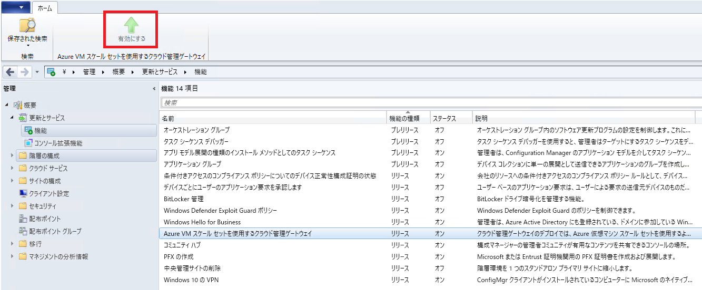
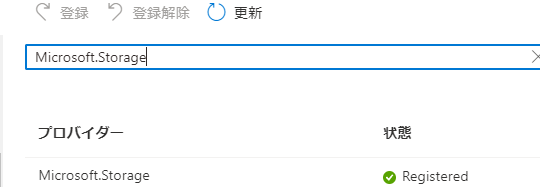
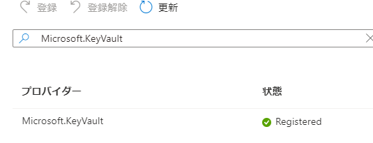
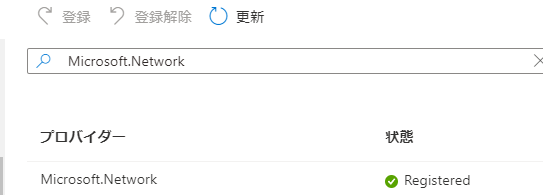
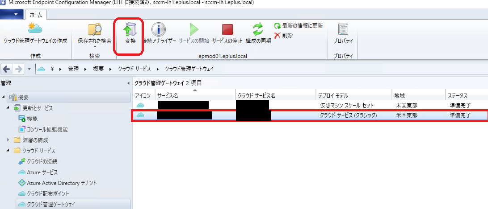
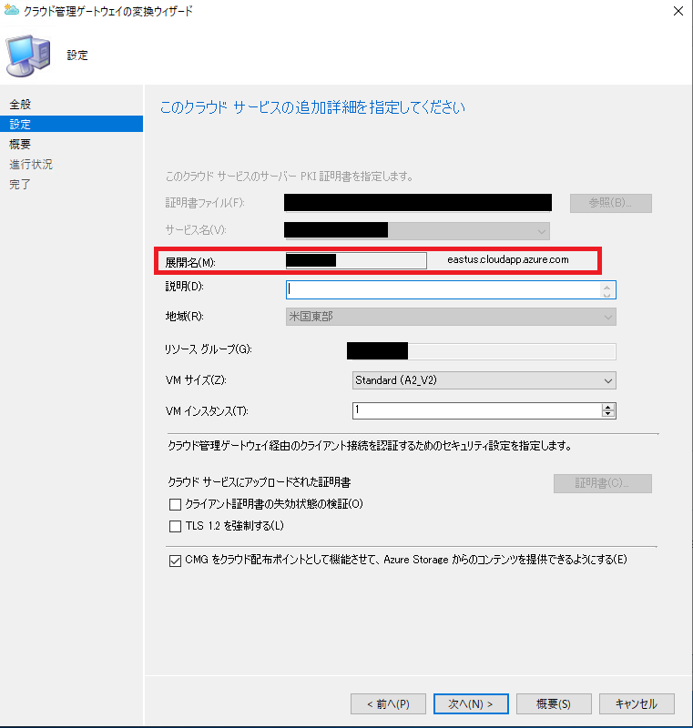
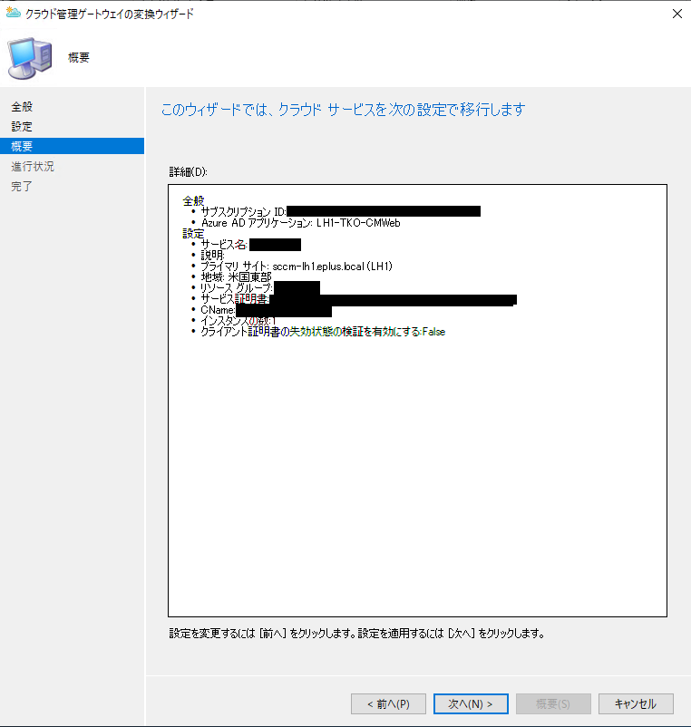
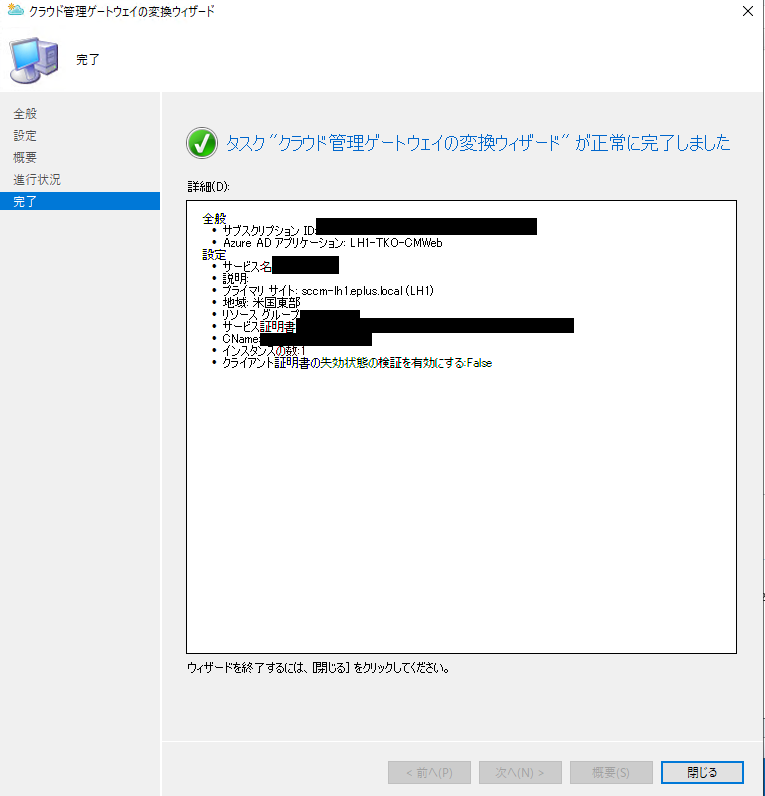

みなさま、こんにちは。Configuration Manager サポート チームです。本日は、Configuration Manager Current Branch (CM CB) 2107 より正式リリースとなりました仮想マシン スケールセットについてとその変換手順についてご案内させて頂きます。

# 仮想マシン スケールセットのクラウド管理ゲートウェイ (CMG) について

仮想マシン スケールセットのクラウド管理ゲートウェイは、CM CB 2103 以前まで主に提供しております、クラウド管理ゲートウェイ (CMG) がベースとしている、Azure のクラウドサービス (クラシック) が 2024年 8月 31日に非推奨となるのに伴い、代替として登場した 仮想マシン スケールセット (VMSS) ベースの CMG です。CB CB 2107 より正式リリースされており、主な特徴として、CSP サブスクリプションをご利用のお客様につきましても、CMG を利用できるようになっております。

# クラウドサービス (クラシック) 版の CMG について

以下ページでもご案内している通り、クラウドサービス (クラシック) 版の CMG のデプロイは、2022年3月1日 以降の CM CB がリリースされ次第、サポートされなくなります。可能な限り、VMSS 版 CMG をご利用頂くようお願い致します。

Title: 推奨されない機能 - Configuration Manager | Microsoft Docs  
URL: https://docs.microsoft.com/ja-jp/mem/configmgr/core/plan-design/changes/deprecated/removed-and-deprecated-cmfeatures#deprecated-features

## VMSS 版 CMG の変更点

以下、サービス外部仕様の変更点となります。  
  
1. 展開名サフィックスの変更
2. 仮想マシンサイズの選択が可能に
3. TCP-TLS ポート利用の廃止

### 展開名サフィックスの変更 

|クラウドサービス|VMSS|
|--|--|
|[ホスト名].cloudapp.net| [ホスト名].[リージョン名].cloudapp.azure.com|

上記の通り展開名のサフィックスが変更となります。この変更に伴い、お客様がインターネットからの名前解決にご利用されている、DNS にて CNAME レコードの設定変更が必要となりますのでご注意ください。DNS の更新手続きが必要な場合は早めに手続き方法その他をご担当者様にご確認されることをお勧め致します。

### 仮想マシンサイズの選択が可能に

クラウドサービス(クラシック) では、A2V2 インスタンスのみがご利用可能でしたが、CM CB 2107 以降の VMSS 版 CMG ではお客様の管理台数規模に応じて、3種類のインスタンスが選択できるようになりました。ラボ環境はテストや Small PoC のみにご利用くださいますようお願い致します。

|用途|インスタンスサイズ|サポート台数|
|--|--|--:|
|ラボ|B2s|10|
|Standard|A2_V2|6,000 |
|大|A4_V2|10,000|

Title: CMG のパフォーマンスとスケール - Configuration Manager | Microsoft Docs  
URL: https://docs.microsoft.com/ja-jp/mem/configmgr/core/clients/manage/cmg/perf-scale#size-and-scale-for-cmg

### TCP-TLS ポート利用の廃止

クラウドサービス (クラシック) で利用していた、クラウド管理ゲートウェイ接続ポイント (CMG-CP) から CMG への TCP-TLS ポート (10140 - 10155) が利用されなくなり、HTTPSポート (443, 10124 - 10139) のみが利用できるようになりました。この変更により、サイト システム設定で Proxy サーバーを設定している場合において、CMG の通信が Proxy サーバーを回避できなくなりました。そのため、VMSS 版 CMG ご利用に当たっては、ご利用されている Proxy サーバーの挙動について良くご確認くださいますようお願い致します。

Title: CMG のデータ フロー - Configuration Manager | Microsoft Docs  
URL: https://docs.microsoft.com/ja-jp/mem/configmgr/core/clients/manage/cmg/data-flow#required-ports

# VMSS 版 CMG への変換について

以降、VMSS 版 CMG への変換についてご案内させていただきます。

1. 変換機能をサポートできない場合について
2. 事前作業
3. 実際の変換手順
4. DNS CNAMEの変更または更新

## 変換機能をサポートできない場合について

サービス名として展開名と同じ、[ホスト名].cloudapp.netをそのままご利用されている場合は、本変換機能をサポートできません。恐れ入りますが、新規に VMSS 版 CMG を構築いただきますようお願い致します。

Title: CMG を変更する - Configuration Manager | Microsoft Docs  
URL: https://docs.microsoft.com/ja-jp/mem/configmgr/core/clients/manage/cmg/modify-cloud-management-gateway#convert

## 事前作業

問題無く変換を完了させるために、以下を確認しておきます。

- 機能の有効化
- リソースプロバイダーの登録確認

### 機能の有効化

以下画面より、「Azure VM スケールセットを利用するクラウド管理ゲートウェイ」のステータスがオンになっていることを確認します。ステータスがオフの場合は、該当機能を選択後、リボンから「有効にする」を選択し、有効化してください。

[CM コンソール] - [管理] - [概要] - [更新とサービス] - [機能]

### リソースプロバイダーの登録確認

VMSS 版の CMG が利用するリソースプロバイダーの登録状況を確認します。

[Azure Portal] - [サブスクリプション] - ご利用のサブスクリプションを選択 - [リソース プロバイダー]ブレード

上記画面で、以下のリソースプロバイダーがそれぞれ"Registered"状態になっているかを確認し、"NotRegistered"になっている場合は画面上部の「登録」ボタンをクリックして"Registered"状態に変更してください。

- Microsoft.Compute

- Microsoft.Storage

- Microsoft.KeyVault

- Microsoft.Network

## 実際の変換作業

実際の変換作業については下記でもご案内しております。  

Title: CMG を変更する - Configuration Manager | Microsoft Docs
URL: https://docs.microsoft.com/ja-jp/mem/configmgr/core/clients/manage/cmg/modify-cloud-management-gateway#convert

以下、スクリーンショット付きでのご案内となります。
なお、変換自体はバックグラウンドで動作し、環境にも依りますが、通常 30 分から 60 分で完了します。

1. MECM CB 2107 以降で下記の画面まで遷移します。  
[CM コンソール] - [管理] - [概要] - [クラウド サービス] - [クラウド管理ゲートウェイ]

2. 「デプロイ モデル」が「クラウド サービス（クラシック)」のクラウド管理ゲートウェイのレコードを選択すると、画面上部のリボンに「変換」アイコンが表示されるので、クリックします。

3. 変換ウィザードが起動します。サインイン状態かどうかを確認し、「次へ」をクリックします。

4. 追加詳細を選択します。本画面で展開名の確認が出来るのでメモしておきましょう。

変更できるのは、以下となります。適宜変更後、「次へ」をクリックします。

- 説明
- VM サイズ

- VM インスタンス数
- クライアント証明書のCRLチェックの要否
- TLS 設定
- CMG-CDPの有効可否

5. 最終確認画面で設定内容を確認後、「次へ」を選択します。

6. 時間経過でウィザードの正常完了画面を確認し、「閉じる」をクリックします。

7. ウィザードを閉じて、クラウド管理ゲートウェイのテーブルを更新すると、現在の変換状況を確認できます。「ステータスの説明」が「サーバーを移行しています」の状態の時は移行作業中です。環境にも依りますが、30分から60分程度作業完了までお待ちください。

## DNS CNAMEの変更または更新

展開名が [ホスト名].cloudapp.net から [ホスト名].[リージョン名].cloudapp.azure.com に変更されているため、インターネットからの名前解決に利用しているDNS のCNAME レコードの更新または作成が必要ですので、ご対応ください。
