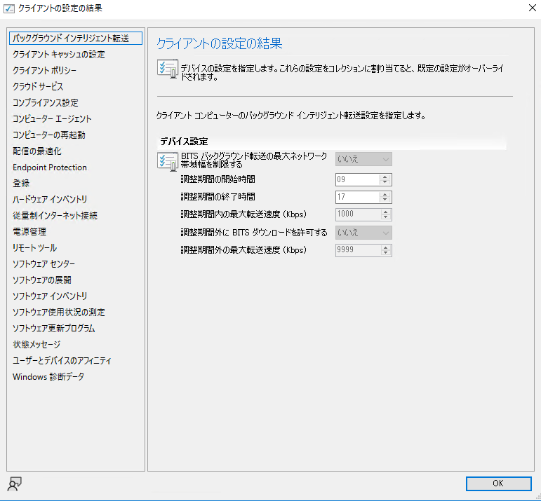
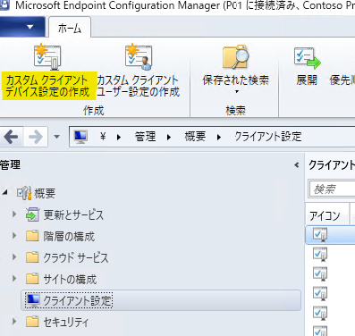
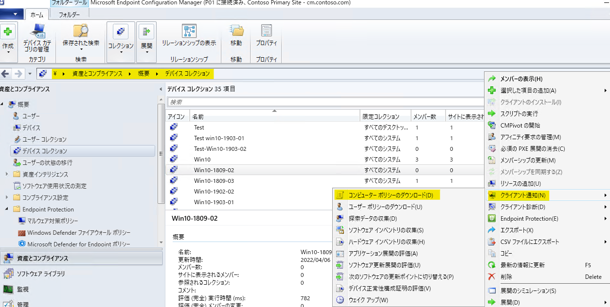

みなさま、こんにちは。Configuration Manager サポート チームです。  

今回はクライアント設定がクライアント上で適用されない時に確認すべき 3 つのポイントについて解説致します。  

## 1.管理コンソールの設定を確認しよう

まずはデバイスに意図したクライアント設定が展開されているのかを確認しましょう。クライアント設定には「優先順位」が設けられております。優先順位が高い順（1 が一番強い）に反映されていきますので、カスタム　クライアント設定を複数作成、展開している場合には、優先順位に注意が必要となります。  
※ 優先順位はクライアント設定間で設定箇所が重複した場合にどちらを優先するのかを決定するものとなります。重複していない設定については優先順位に関係なく、クライアントに反映されます。  
複数のクライアント設定を展開していて、最終的に何が反映されるのかわからなくても大丈夫です。  
MECM 管理コンソール > [資産とコンプライアンス] > [概要] > [デバイス] にて確認したいデバイスを右クリック > [クライアント設定] > [クライアントの設定の結果] をクリックすると、最終的にどの設定が反映されているのかを確認することができますので、ここで想定していた設定となっていることを確認ください。  
  

このように結果を確認することができます。  



## 2.カスタム クライアント設定を上書き展開してみよう

1 で想定している設定値となっているにも関わらず、クライアント端末側に反映されていない場合には、新たにカスタム クライアント設定を作成し、展開してみましょう。  

反映されない設定と全く同じ内容でカスタム クライアント設定を作成してください。  
[管理] > [概要] > [クライアント設定] > [カスタム クライアント デバイスの作成]
  

この時「優先順位」をなるべく高くしておくことがポイントです。  
（少なくとも反映されないカスタム クライアント設定よりも高くしてください。）  
新規に作成したカスタム クライアント設定を右クリック > [優先順位を上げる] をクリックします。  
  

優先順位を高くしたら、該当のコレクションに展開してみましょう。  

展開後はクライアント側の次回のコンピューター ポリシー取得のタイミングで反映されるので少し時間をおきましょう。  

もしすぐに反映を促したい場合には、[資産とコンプライアンス] > [概要] > [デバイス コレクション] にてコレクションを右クリック > [クライアント通知] > [コンピューター ポリシーのダウンロード] をクリックすることでクライアント通知により、ポリシー取得を促すことができますのでお試しください。  

  

## 3.クライアント側で管理ポイントとの疎通状況を確認しよう

それでも反映されない場合には、クライアントと管理ポイントとの疎通の状態を確認しましょう。  

1.C:\Windows\CCM\Logs フォルダー配下の CcmMessaging.log を開き、直近の日付で下記のような出力があるかを確認します。  

```text
OutgoingMessage(Queue='XXXXXXXXXXXXX', ID={XXXXXXXX-XXXX-XXXX-XXXX-XXXXXXXXX}): Delivered successfully to host '<管理ポイント FQDN>'.
```

2.C:\Windows\CCM\Logs フォルダー配下の PolicyAgent.log を開き、「2.カスタム クライアント設定を再展開してみよう」を展開後に下記のような出力があるかを確認します。  

```text
Raising event:instance of CCM_PolicyAgent_PolicyDownloadSucceeded
Raising event:instance of CCM_PolicyAgent_PolicyEvaluationComplete
```

もし、上記のどちらかが確認できなかった場合には、管理ポイントからポリシーのダウンロードが完了していないことになります。管理ポイントとの通信状況を確認しましょう。  

クライアント端末にて、PowerShell を開き、下記コマンドを実行します。  

```powershell
Invoke-WebRequest -Uri "http://<管理ポイントの FQDN>/sms_mp/.sms_aut?mplist" -UseBasicParsing
```

正常にアクセスできる場合、StatusCode : 200 となります。
それ以外の場合には、クライアントと管理ポイントとの間で疎通できていない状態となりますので、ご利用のネットワーク環境上で通信を妨げる何かしらの要因がありますのでご確認くださいませ。  

## 4.ログ出力が確認できないが、疎通は成功する場合

この場合には、詳細な調査が必要となることが想定されますので、弊社サポートへのお問い合わせをご検討下さいませ。  

なお、お問い合わせいただける際には、下記の情報が必要となりますので予め採取いただけると幸いでございます。

### クライアント設定が格納されている WMI の取得

PowerShell を管理者として開き、下記コマンドを実行ください。

「<取得する WMI クラス名>」箇所は [WMI クラス対応表](#WMIクラス対応表) をご確認の上、問題となるクライアント設定と紐づくクラス名に置き換えて実行くださいませ。  

```powershell
gwmi -namespace root\ccm\policy\machine\actualconfig -class <取得する WMI クラス名> > C:\result\actualconfig.txt
gwmi -namespace root\ccm\policy\machine\requestedconfig -class <取得する WMI クラス名> > C:\result\requestedconfig.txt
```

例：「バックグラウンド インテリジェント転送」のクライアント設定が問題の場合
この場合には対象の WMI クラスが 2 つ存在するため、出力ファイル名を変えて実行します。  

```powershell
gwmi -namespace root\ccm\policy\machine\actualconfig -class CCM_Service_BITS2Configuration > C:\result\actualconfig_1.txt
gwmi -namespace root\ccm\policy\machine\requestedconfig -class CCM_Service_BITS2Configuration > C:\result\requestedconfig_1.txt

gwmi -namespace root\ccm\policy\machine\actualconfig -class CCM_Service_BITSConfiguration > C:\result\actualconfig_2.txt
gwmi -namespace root\ccm\policy\machine\requestedconfig -class CCM_Service_BITSConfiguration > C:\result\requestedconfig_2.txt
```

### WMI クラス対応表
  
---
| 名前 | クラス |
|--|--|
| バックグラウンド インテリジェント転送 | CCM_Service_BITS2Configuration |
|  | CCM_Service_BITSConfiguration |
| クライアント キャッシュの設定 | CCM_SuperPeerClientConfig |
| クライアント ポリシー | CCM_PolicyAgent_Configuration |
| クラウド サービス | CCM_CloudClientConfig |
| コンプライアンス設定 | CCM_ConfigurationManagementClientConfig |
| コンピューター エージェント | CCM_ClientAgentConfig  |
| コンピューターの再起動 | CCM_RebootSettings |
| 配信の最適化 | CCM_WindowsDOClientConfig |
| Endpoint Protection | CCM_EndpointProtectionClientConfig |
| ハードウェア インベントリ | InventoryDataItem |
|  | CCM_HardwareInventoryClientConfig |
|  | CCM_Scheduler_ScheduledMessage |
| 従量制インターネット接続 | CCM_NetworkSettings |
| 電源管理 | CCM_Scheduler_ScheduledMessage |
| リモート ツール | CCM_RemoteToolsConfig |
| ソフトウェア センター | CCM_SoftwareCenterClientConfig |
| ソフトウェアの展開 | CCM_Scheduler_ScheduledMessage |
| ソフトウェア インベントリ | CCM_SoftwareInventoryClientConfig |
| ソフトウェア使用状況の測定 | CCM_SoftwareMeteringClientConfig |
| ソフトウェア更新プログラム | CCM_SoftwareUpdatesClientConfig |
