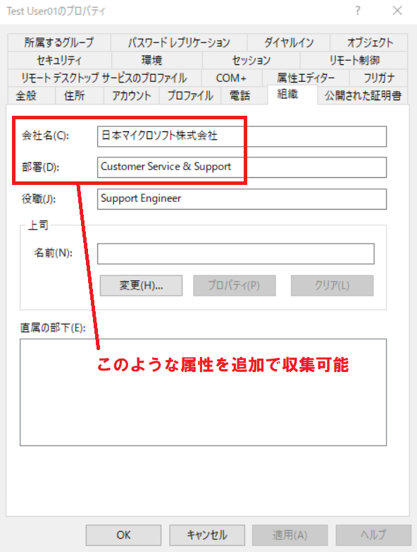
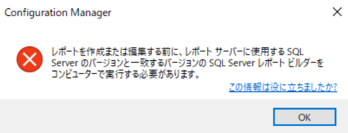
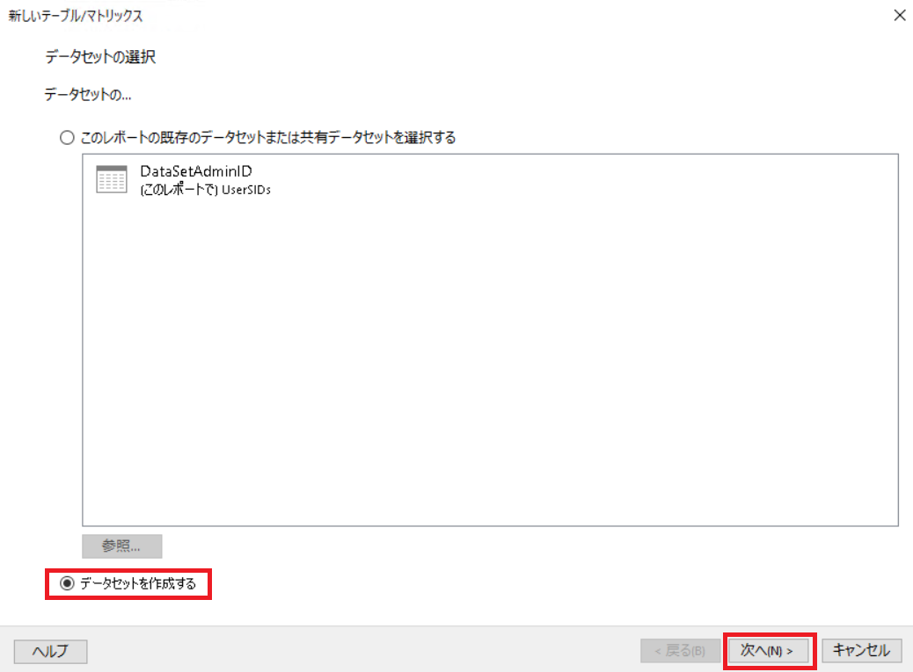
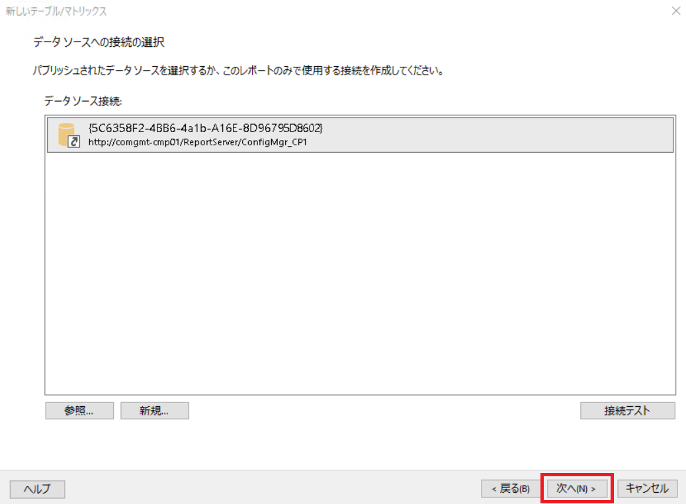
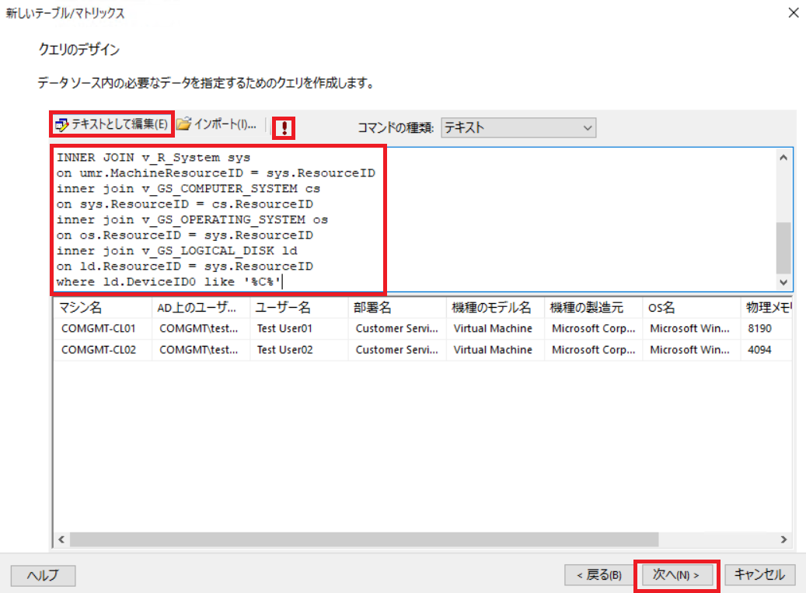
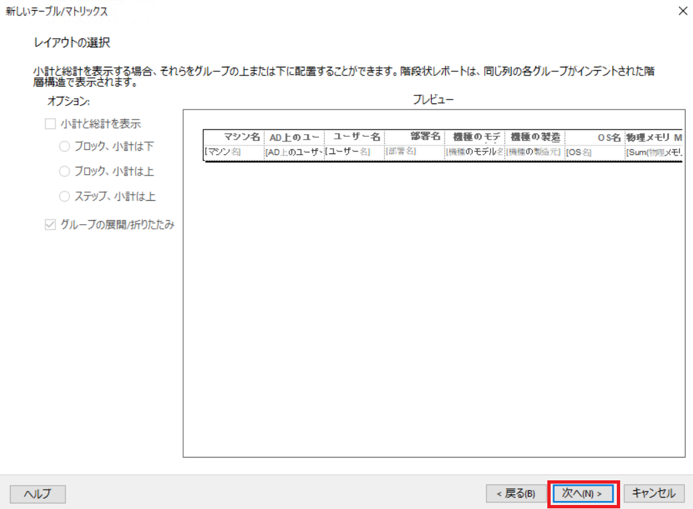
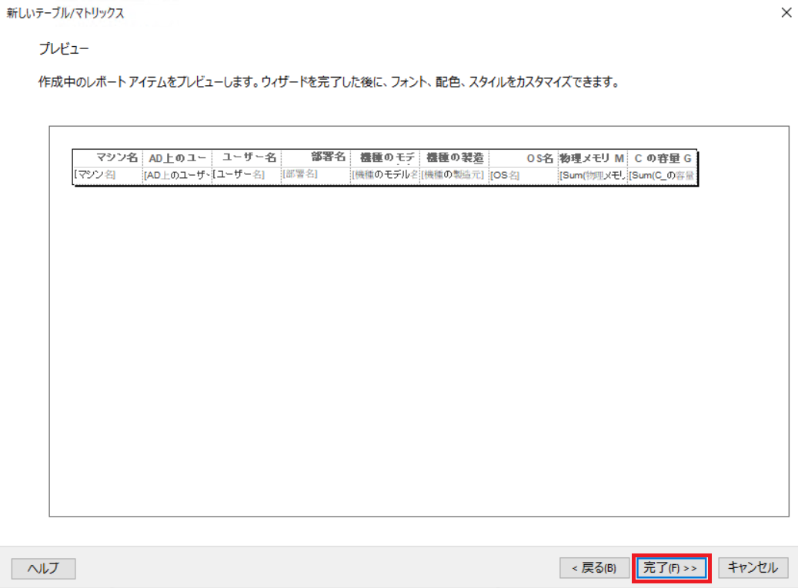
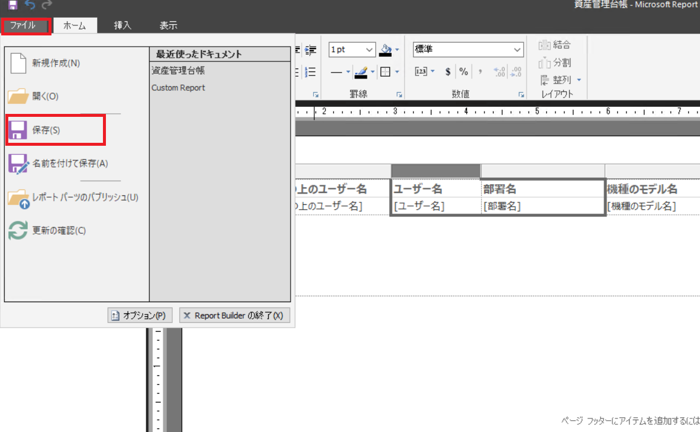
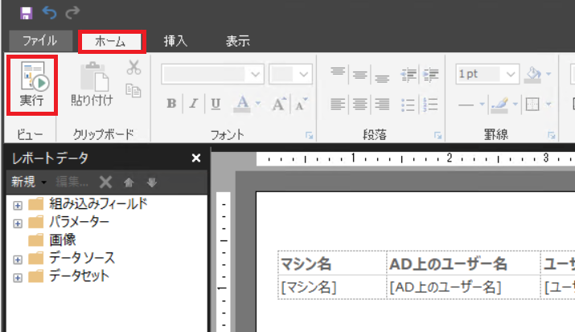

みなさま、こんにちは。Configuration Manager サポート チームです。  
今回は Microsoft Endpoint Configuration Manager (以下 Configuration Manager) でカスタム レポートを作成する手順をご案内します。

例として、**資産管理台帳** ということでパソコンの所持ユーザーに紐づくマシン名と、管理者の部署名も表示するというものを作成します。  
Configuration Manager の情報が格納されている SQL Server データベースの基礎知識などもカバーしますので、これから Configuration Manager で様々な情報を管理されたいという方は是非ともご参考ください。  

サンプルだとマシン数も少なく、機種名が仮想環境のため見栄えがしませんが、以下のようなレポートを作成します。  


## ステップ 1: [Active Directory ユーザーの探索] で、追加収集する属性を設定する
資産管理台帳を表示するにあたって、管理者の会社名や部署名といった情報も取得したいという要件があります。  
これを実現するには、「Active Directory ユーザーの探索」において収集する属性を追加します。

1. Configuration Manager コンソールを開きます。
2. コンソール画面左のツリー表示より、[階層の構成] - [探索方法] を選択します。
3. 画面右の、探索方法の一覧より、[Active Directory ユーザーの探索] をダブルクリックし、プロパティ画面を開きます。
4. [Active Directory の属性] タブを表示します。
5. ウィンドウ左下の [利用可能な属性] は、Active Directory 上のユーザー オブジェクトの属性を示します。  


例えば、部署名は [department]、会社名は [company] となります。  


department, company を例として追加しますが、任意でその他の属性を追加いただいても構いません。

※ 補足: ここで追加した属性は、後述の Configuration Manager の SQL のビュー "v_R_User" に、当該の名称で属性が追加されます。

6. 追加した属性は、次回の Active Directory ユーザーの探索の周期にて、収集されて Configuration Manager のデータベースに格納されます。
直ちに実行したい場合、手順 3 の [Active Direcotry ユーザーの探索] を右クリックし、[今すぐ完全な探索を実行する] を選択します。

上記は、Active Directory ユーザーの探索の例ですが、その他、Active Directory システムの探索 (コンピューター オブジェクト) でも、Active Directory 属性の追加が可能ですので、応用してください。

## ステップ 2: SQL のクエリを作成する
Configuration Manager にて格納された情報について SQL クエリを実行し、必要な情報をまとめて表示します。
レポートの元となる SQL クエリについては、[SQL Server Management Studio] から試行錯誤し、作成します。  
SQL クエリの実行方法については、以下の手順をご参照ください。

Title: SQL Query 結果の出力方法について  
URL: https://jpmem.github.io/memlog/configmgr/sql/sqlquery.html

クエリの作成にあたっては、後述補足の、"SCCM データベースのクエリ作成の基礎知識" をご参考ください。

以下は、ユーザー名に紐尽くプライマリ デバイスと、その基本的な情報を表示する資産台帳の表示を行うカスタム クエリです。
ユーザーが最も長く使用するプライマリ デバイスを使用しています。
ユーザー名と、そのプライマリ デバイスの関連性は v_UserMachineRelationship ビューに格納されています。

クエリ例

```sql
SELECT sys.Netbios_Name0 as "マシン名", u.Unique_User_Name0 as "AD上のユーザー名",
u.Full_User_Name0 as "ユーザー名", u.department as "部署名",
cs.Model0 as "機種のモデル名", cs.Manufacturer0 as "機種の製造元",
left (os.Name0,charindex ('|', os.Name0)-1) as "OS名", os.TotalVisibleMemorySize0 as "物理メモリ(MB)",
(ld.Size0 / 1024) as "C:の容量(GB)"
FROM
v_UserMachineRelationship umr
INNER JOIN v_R_User u
on umr.UniqueUserName = u.Unique_User_Name0
INNER JOIN v_R_System sys
on umr.MachineResourceID = sys.ResourceID
inner join v_GS_COMPUTER_SYSTEM cs
on sys.ResourceID = cs.ResourceID
inner join v_GS_OPERATING_SYSTEM os
on os.ResourceID = sys.ResourceID
inner join v_GS_LOGICAL_DISK ld
on ld.ResourceID = sys.ResourceID
where ld.DeviceID0 like '%C%'
```

## ステップ 3: レポートを作成する
B で作成した SQL クエリを表示する、簡単なカスタム レポートの作成手順です。  
事前準備として、レポートの編集に必要な Report Builder をインストールしてください。

Title: Microsoft® Report Builder  
URL: https://www.microsoft.com/en-us/download/details.aspx?id=53613

インストール ウィザードの途中の "既定の対象のサーバー" の入力項目はブランクのままインストールを進めてかまいません。  


1. Configuration Manager コンソールより、[監視] ワークスペースを開きます。

2. [レポート] - [レポート] を右クリックして [レポートの作成] をクリックします。

※ Report Builder が未インストールの場合、以下のエラーが表示されますので、そのときは Report Builder をインストールしてください。  


3. [レポートの作成ウィザード] では、レポートの名前と説明を入力します。パスは、レポートがどのフォルダーに格納されるかが設定されますが、任意で結構です。

※ 独自に作成したフォルダーをパスに指定したい場合は、予めブラウザでレポート マネージャー (http://<ホスト名>/Reports) を開き、[ConfigMgr_<サイト コード>] フォルダー直下に、任意の名前でフォルダーを作成してください。  


4. ウィザードを完了させると、SQL Server レポート ビルダーが起動します。初回起動時に以下のダイアログが出力されるので [はい] をクリックします。　　


5. 画面中央の [テーブルまたはマトリックス] を選択します。  


6. [新しいテーブル/マトリックス] ウィザードが表示されます。[データセットを作成する] のチェックのまま、次へ進みます。  


7. [データソース接続] については、既定のまま、次へ進みます。"データ ソースの資格情報の入力" ダイアログが表示された場合、[現在の Windows ユーザーを使用する] を選択して [OK] をクリックします。  


8. [クエリのデザイン] 画面では、画面左上の [テキストとして編集] をクリックし、白紙個所に B で作成したクエリを張り付けます。実行ボタン [!] を押すことで、プレビューも可能です。  


9.  [フィールドの配置] 画面では、[使用できるフィールド] のすべてを、[値] にドラッグ ドロップします。  


10. [レイアウトの選択] 画面で、[次へ] をクリックします。  


11. プレビューを確認して [完了] をクリックし、ウィザードを完了します。  


12.  Report Builder の最初の画面に戻ります。列幅やフォントなどレイアウトを任意で整えた後、[ファイル] - [保存] をクリックして閉じます。  


※ Report Builder 内の [実行] をクリックすることで、Report Builder 上で結果のプレビューを確認することもできます。  


13. Configuration Manager コンソールの [監視] ワークスペース、[レポート] - [レポート] から、作成したレポートを検索して、実行します。  


このように、SQL Server に直接クエリするのではなく Configuration Managerのレポートから閲覧可能となります。
レポートごとにアクセス権を設定できる点や、様々な形式でエクスポート可能であることがメリットです。

## 補足: Configuration Manager データベースのクエリ作成の基礎知識
カスタム クエリを作成いただくにあたって、知っておきたい Configuration Manager データベースの基礎知識は以下となります。

- はじめに、既存のレポートを色々と触ってみることをお奨めします。既存のレポートは様々な「よくある要望」を達成するため、用意されています。レポートの一覧は[こちらの公開情報](https://docs.microsoft.com/ja-jp/mem/configmgr/core/servers/manage/list-of-reports)にも掲載されておりますので、ご確認ください。

- カスタム レポートを作成すると決断した場合、手始めに、Configuration Manager の既存のレポートから、目的に類似したものをまずは見つけることをお奨めします。既存のレポートを [右クリック] - [編集] し Report Builder から見ることで、どのようなクエリを発行しているのか確認できます。
以下の画面ショットのように、[データセット] - [DataSet] のプロパティを表示し、クエリを確認します。
特に、"from" 句で、どのビューを参照・結合しているのかが分かれば、SQL データベースとにらめっこをしなくても、即座に見るべきビューのあたりをつけることができます。

- SQL クエリを書く場合、Configuration Manager では、テーブルではなく、ビューを使用してクエリを作成してください。(テーブルの直接参照はサポートされません。)

- [Active Directory ユーザーの探索] で探索したユーザー属性は、"v_R_User" ビューに格納されます。また、コンピューター オブジェクトの場合、"v_R_System" になります。

- Configuration Manager で収集されたハードウェア インベントリ情報の多くは、"v_GS_<カテゴリー名>" のビューに格納されています。これらのビューを結合するにあたっては、マシンごとに一意に振られている "ResourceID" というキー値を使用することが有効です。"ResourceID" が一致するよう、これらのビューを結合 (Join) することで、特定のマシンについての様々なインベントリ情報を結合出来ます。

インベントリにて、どのような情報が収集されているかについては、[リソース エクスプローラー] からご確認ください。
Configuration Manager コンソールの [資産とコンプライアンス] ワークスペースより、コレクションからマシン名を選択し、[開始] - [リソース エクスプローラー] を開始します。
画面左のツリーから一覧可能なカテゴリーは、すべて v_GS_<カテゴリー名> のビューに格納されています。

上記のようなビューに関する情報は、以下の公開情報でもご案内しておりますので、こちらもどのビューを使用するか決定する際にお役立ていただければと思います。

Title: SQL Serverマネージャーのビューを表示する  
URL: https://docs.microsoft.com/ja-jp/mem/configmgr/develop/core/understand/sqlviews/sql-server-views-configuration-manager