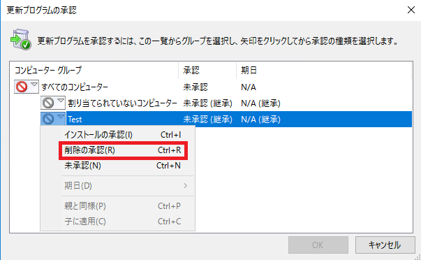
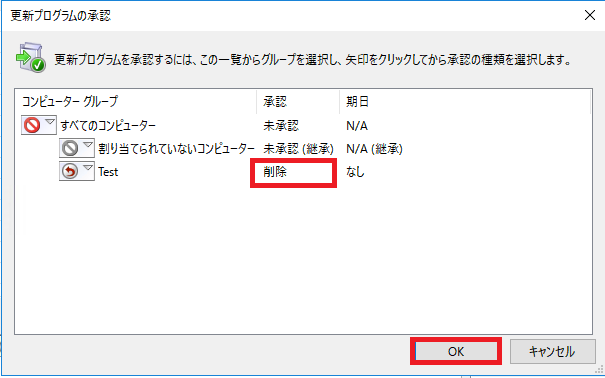
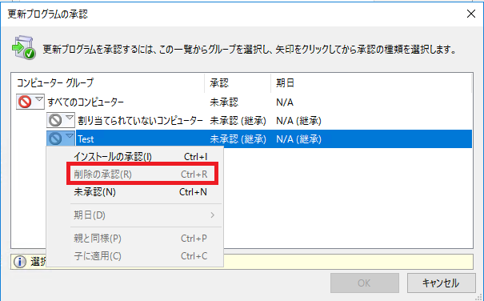

# WSUS で「削除の承認」を行い、更新プログラムを削除する
※ Windows 10 / Windows Server 2016 の環境では「削除の承認」が動作しない問題が報告されています。詳細はこちらの[ブログ](https://jpmem.github.io/blog/wsus/2017-09-04_01/)を参照ください。  

皆さま、こんにちは。WSUS サポート チームです。  

WSUS で更新プログラムを管理されている皆さまの中には、「間違った更新プログラムを配信してしまった！削除したい！」という状況になった方もおられるのではないでしょうか。  
そのような状況において、WSUS で有効な機能が 「削除の承認」 です。この機能はあまり知られていませんが、WSUS で配信した更新プログラムをクライアント PC からアンインストールすることができます。  
更新プログラムの中には「削除の承認」ができないものもありますが、更新プログラムを削除する方法の 1 つとして有効です。  

KB3150513 を例として WSUS より「削除の承認」を行う手順を以下にご紹介します。WSUS で配信した更新プログラムを削除したいときに、是非ご活用ください！  

## 手順
1. WSUSサーバーにログインします。
1. [スタート] - [管理ツール] - [Windows Service Update Services] をクリックします。
1. WSUS 管理コンソールが起動しますので、左画面から、[セキュリティ更新プログラム] をクリックします。
1. 中央画面の上部から、"承認" を [拒否された更新以外のすべて]、"状態" を [任意] に設定し、[最新の情報に更新] をクリックし画面を更新します。
1. 中央画面のリストから、削除対象とする更新プログラムである KB3150513 を見つけます。
1. 対象の更新プログラムを右クリックして、[承認] をクリックします。
1. "更新の承認" 画面が起動しますので、更新プログラムを削除したい PC を含むグループのドロップダウンから、[削除の承認] をクリックします。  
  
1. [OK] をクリックして、画面を閉じます。  
  
1. WSUS クライアントは定期的に WSUS サーバーへ接続を行いますので、そのタイミングで自動更新の設定に基づいてアンインストールを行います。  
(例：グループ ポリシー「自動更新を構成する」のオプション 4 番「自動ダウンロードしインストール日時を指定」を設定している場合は、設定している日時にアンインストールされます。)  

なお、「削除の承認」に対応していない場合は、手順 7. の [削除の承認] がグレーアウトして選択することができません。そのため、[削除の承認] がグレーアウトしているかどうかをご確認いただくことで、WSUS で対象の更新プログラムを削除できるかどうかご判断いただけます。  
  

(補足)
手順 1. ～ 5. の更新プログラムを見つける手順は、以下の手順でも代用可能です。  

1. WSUS 管理コンソールを起動して、左ペインのツリーより [更新] をクリックします。
1. 右ペインの [検索...] をクリックします。
1. 検索ボックスに KB3150513 と入力して、[検索] をクリックします。
4. 検索結果に KB3150513 に一致する更新プログラムが表示されますので、削除対象とする更新プログラムを見つけます。

