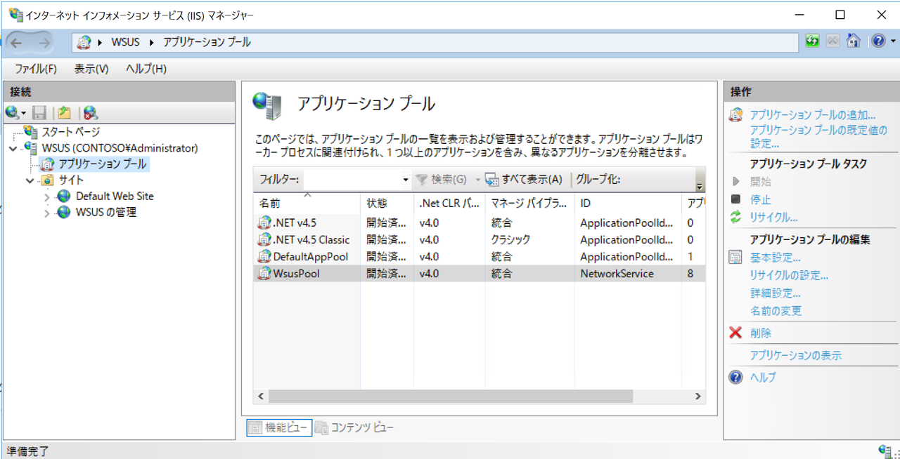

# WSUS コンソールが全く開かなくなってしまった！ WsusPool の停止とは
みなさま、こんにちは。 WSUS サポート チームです。  
今回は、 WSUS コンソールが全く開かず、以下のような接続エラーがでてしまっているときにご一読いただきたい WsusPoolの停止 についてご紹介します。  
   

# WSUS コンソールが全く開かなくなってしまった！  
WSUS は、 IIS の WsusPool を介してデータベースへアクセスする仕組みになっています。  
WsusPool は、IIS のアプリケーション プールであり、IIS のワーカープロセス (w3wp.exe) として動作しますので、以下のように IIS マネージャーから WsusPool の動作状況を確認できます。 
 

その為、 Windows Internal Database や SQL Server などデータベース サービスが動作しているにも関わらず、 WSUS コンソールが全く開かず上記のような接続エラーとなってしまう場合には、WsusPool が停止しデータベースへアクセスできない状態となっている可能性が考えられるのです。  

# WsusPool の停止とは
なぜ WsusPool が停止していると考えられるでしょうか。  
これは、IIS の保護機能により WsusPool が停止した可能性があるからです。  

WsusPool のメモリ上限値であるプライベート メモリ制限値に達した場合、リサイクルを実行しメモリを解放する動作が起こります。このリサイクルの処理が短期間に頻繁に発生すると、 IIS のラピッド フェール保護と呼ばれる機能が働き、WsusPool を停止させるのです。  

ラピッド フェール保護の機能解説としては以下の公開情報をご参照ください。  
[ラピッド フェール保護機能について](https://jpdsi.github.io/blog/web-apps/Rapid-Fail-Protection/)  

その為、 WsusPool のメモリ上限値であるプライベート メモリ制限値に達してリサイクルが頻発する状態を改善することで、ラピッド フェール保護による WsusPool が停止する事象を防ぐことができます。

# 発生要因
WsusPool のメモリ上限値であるプライベート メモリ制限値に達してしまう主な要因はなにか。  
それは主に以下の2点です。  
1．WsusPool のチューニングが実施されていない  
2．クライアントのスキャン対象となる更新プログラムが多い  

# 対処方法
上記の要因を解消するためには、以下の対処により改善が見込めます。    

## 1．WsusPool のチューニング  
WsusPool のチューニングを実施することにより、WsusPool が使用可能なプライベート メモリ上限が引き上げられる上、ラピッドフェール保護の発生条件を緩和できますので、ラピッド フェール保護の発生による WsusPool の停止を抑止することができます。  
実施内容については、以下の公開記事にてご紹介しておりますのでご参照ください。  
 [IIS チューニング設定](https://jpmem.github.io/blog/wsus/2022-05-09_01/#A-IIS-%E3%83%81%E3%83%A5%E3%83%BC%E3%83%8B%E3%83%B3%E3%82%B0%E8%A8%AD%E5%AE%9A)  

## 2．クライアントのスキャン対象となる更新プログラムの削減    
クライアントは WSUS 同様に IIS を介してデータベースへアクセスし更新プログラムのスキャン処理を行っています。  
スキャン処理は、WSUS が保持する更新プログラムの情報（メタ データ）が参照され、メタ データをメモリ領域に展開するために必要なメモリ領域の確保とデータのメモリへのコピーが繰り返される為、 WsusPool のメモリ使用量を高める大きな要因となることが事例より判っております。

クライアントのスキャン処理の対象は、状態が "未承認" 及び "承認済み" の更新プログラムです。  
"拒否済み" 状態の更新プログラムはスキャン処理の対象外であり、上記のようなメタ データへのメモリへのコピーは行われません。   
このため、状態を "拒否済み" へ変更いただくことにより、スキャン対象から外すことができ、WsusPool のメモリ使用量を抑えることができます。    
実施内容ついては、以下の公開記事にてご紹介しておりますのでご参照ください。  
[不要な更新プログラムは「拒否済み」に設定しよう！](https://jpmem.github.io/blog/wsus/2017-12-11_01/)  

