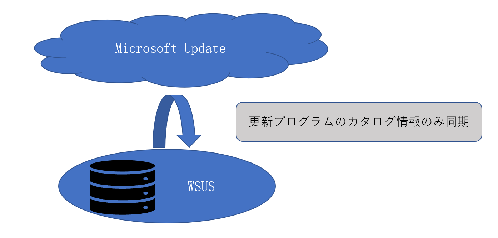
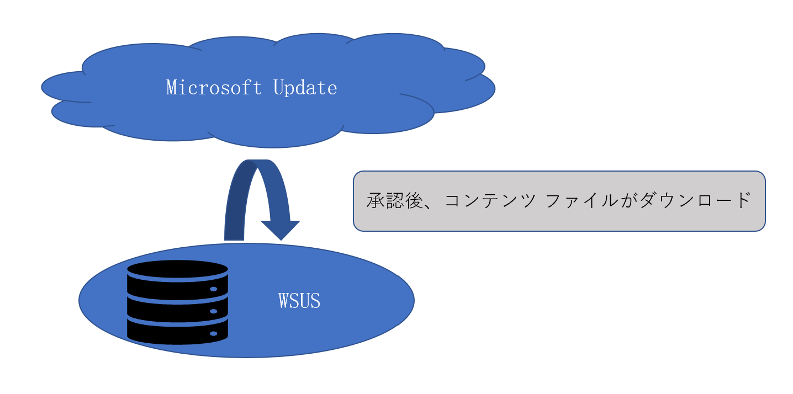
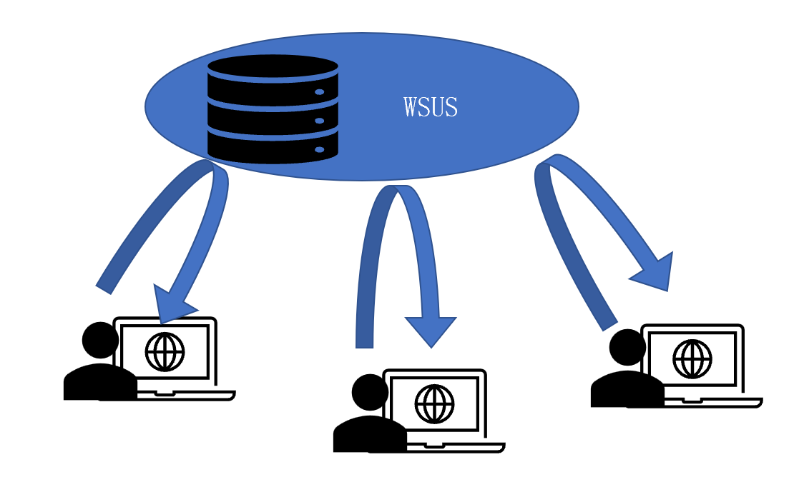
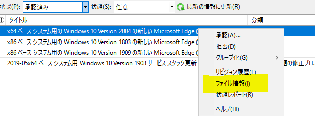
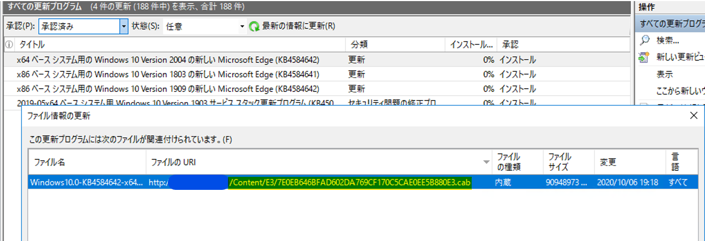
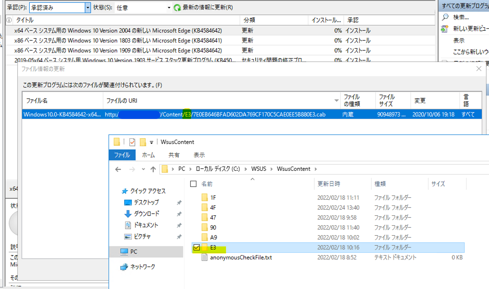
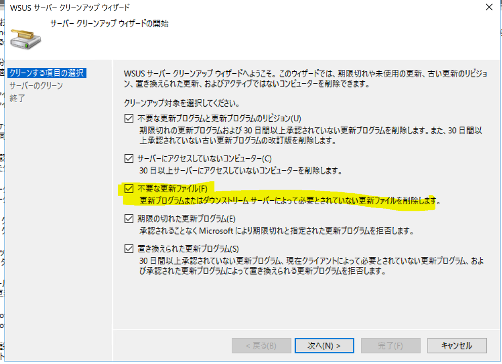

# WSUS の仕組み ダウンロード編

みなさま、こんにちは。WSUS サポート チームです。

今回は、WSUS の仕組みについて、少し掘り下げてご紹介していきたいと思います。  
WSUS は更新プログラムをクライアントへ配信できる機能であることはご存じの方も多いかと思いますが、どのような過程を経て更新プログラムがクライアントに取得されるかご存じでしょうか。  
仕組みの理解やトラブルシューティング時にもお役立ていただけるとなっておりますのでぜひご一読ください！

# WSUS の仕組み

WSUS からクライアントが更新プログラムを取得するまでの流れ配下の通りです。（既定動作）

1. WSUS 同期
2. 更新プログラムの承認
3. クライアントが承認情報を取得

解説

1. WSUS 同期  
   WSUS は、更新プログラムを同期させる際に、カタログ情報と呼ばれるメタデータをダウンロードします。  
   この時、更新プログラムのコンテンツファイルと呼ばれる実体ファイルはダウンロードしません。  
   このカタログ情報は実体となるコンテンツファイルよりも非常にファイルサイズは小さいものとなります。
   

2. 更新プログラムの承認  
   2-1.承認作業を実施することにより、データベースへ承認情報が変更されます。  
   2-2. WSUS にて承認作業が行われることによって、更新プログラムのコンテンツ ファイルのダウンロードが開始されます。
   このとき実体のファイルがダウンロードされます。  
   

3. クライアントが承認情報を取得
   クライアントは、（ランダム時間を含む）既定で約 22 時間毎に WindowsUpdate の自動更新を実行し、 WSUS へスキャン処理を実施します。自らに必要な更新プログラムが承認されていた場合には、その情報をもとに、自動更新の構成ポリシーの設定に従って適用作業を実施します。  
   

補足情報  
WSUS サーバー上のコンテンツ ファイルの有無を確認  
1． WSUS コンソールで対象の更新プログラムを右クリックし「 ファイル情報 」を参照します。  
  
2．更新プログラムの URI が表示されています。これが更新プログラムの実体ファイルの格納先になります。  
  
3． WSUS サーバーのエクスプローラーから「 WsusContent 」フォルダーを開きます。  
 　 2 ケタの英数字で名づけられたフォルダーが複数存在しますので、手順 2 で確認したファイルパス内に記載されているフォルダーをたどっていきます。  
   
4．フォルダー内に格納されているファイルが存在するかを確認します。  
 

コンテンツ ファイルの削除方法  
1.承認済みの更新プログラムの拒否済みへ変更します。  
2.クリーンナップウィザードの "不要な更新ファイル" を実施しますと拒否済みとした更新プログラムのコンテンツ ファイルがサーバーから削除されます。  

